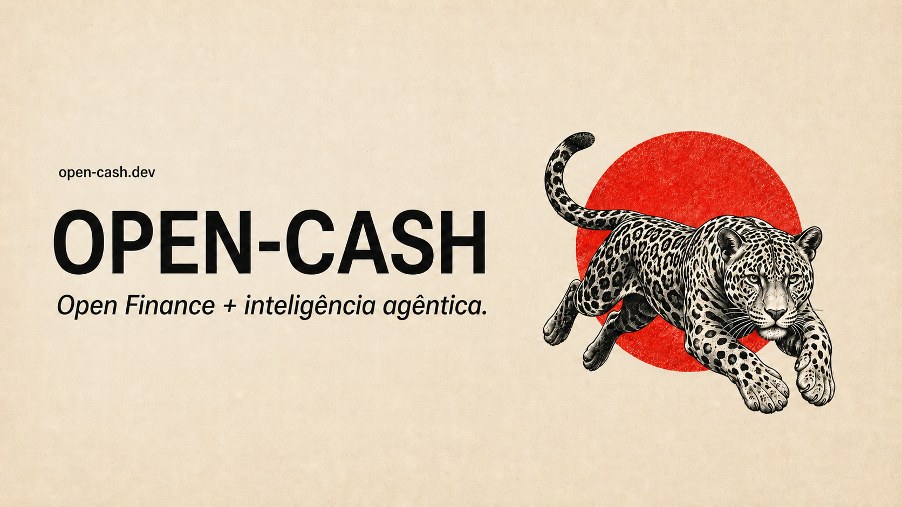

# Open Cash



Open Cash is a multi-user Open Finance platform built on Cloudflare Workers.
It combines an authenticated financial dashboard, Pluggy connections and a
private AI assistant for accounts, cards, transactions and investments.

The project is designed as a platform rather than a single-user CLI: each user
has their own account, sessions, Open Finance connections, preferences and
conversations. The API carries the authenticated `userId` through every
financial operation and validates ownership before data or agent access is
allowed.

## What it provides

- Email/password authentication, email verification, sessions, 2FA and API keys.
- Per-user Pluggy connections with client secrets sealed before persistence.
- Read-only account, balance, transaction, credit-card and investment views.
- Conversation streaming through a private Flue Agent Worker.
- Durable conversations and isolated file work through Durable Objects, R2 and Sandbox.
- A typed Hono/oRPC API with generated OpenAPI documentation.
- Cloudflare AI Gateway for model routing, caching, retries and budget controls.

## Pluggy and Open Finance setup

Pluggy is configured per authenticated user, not through a shared
`PLUGGY_CLIENT_ID` or `PLUGGY_CLIENT_SECRET` in the repository environment.
This is important for the multi-user model: one user can have multiple
connections, and every connection keeps its own Pluggy application credentials
and item IDs.

To create a connection:

1. Create or access the Pluggy application that will be used for the account.
2. Connect the desired bank accounts through the Pluggy/Meu Pluggy flow.
3. Collect the application's `clientId` and `clientSecret`, plus the `itemId`
   for each connected Pluggy item.
4. Sign in to Open Cash and open **Settings → Open Finance → New connection**.
5. Enter a name, the client ID, the client secret and the item IDs separated by
   commas. For example:

   ```text
   Name:        Meu banco principal
   Client ID:   <pluggy-client-id>
   Client secret: <pluggy-client-secret>
   Item IDs:    <item-id-1>, <item-id-2>
   ```

The same operation is available to an authenticated client through
`POST /v1/connections`:

```json
{
  "name": "Meu banco principal",
  "clientId": "<pluggy-client-id>",
  "clientSecret": "<pluggy-client-secret>",
  "itemIds": ["<item-id-1>", "<item-id-2>"]
}
```

When the connection is saved, the API validates the item IDs with Pluggy,
encrypts the client secret with `FINANCE_ENCRYPTION_KEY` before storing it in
D1, and never returns the secret in API responses. The short-lived Pluggy API
key cache is scoped by both the authenticated user and the connection. Do not
put Pluggy credentials or item IDs in `.env`, `wrangler.jsonc` or source code;
the user enters them through the authenticated settings flow.

The reference project [cata-centavo](reference/cata-centavo/README.md) uses a
global environment setup with `PLUGGY_CLIENT_ID`, `PLUGGY_CLIENT_SECRET` and
`PLUGGY_ITEM_IDS`. Open Cash intentionally adapts that setup to a persistent,
multi-user platform, so those variables are not part of `.env.example`.

## Architecture

```text
Browser
  │ Better Auth session / API key
  ▼
Web Worker (React + Vite)
  │ HTTPS and credentials
  ▼
API Worker (Hono + Better Auth + oRPC)
  ├── D1: users, sessions, settings, connections and conversation ownership
  ├── KV: secondary auth storage, identity bridge and Pluggy token cache
  ├── R2: profile files and conversation files
  ├── Pluggy: provider reads scoped to the authenticated user
  └── AGENT_SERVICE Service Binding
          ▼
      Private Agent Worker (Flue)
          ├── Durable Objects: agent state and conversations
          ├── Sandbox: isolated document and spreadsheet work
          └── API Worker /mcp: authenticated, connection-scoped tools
```

The Agent has no public `workers.dev` or preview URL. The browser calls the API;
the API authenticates the user, checks conversation ownership and forwards AI
traffic through the `AGENT_SERVICE` binding. The Agent then calls the API's MCP
surface with the conversation's user and connection scope.

## MCP status

The MCP endpoint is currently an internal platform capability. It is used by
the Open Cash Agent and authenticated application flows; it is not yet a
general-purpose external integration for arbitrary MCP clients.

External MCP authorization through OAuth is planned. The OAuth implementation
will need to define client registration, authorization and consent screens,
scopes, token issuance, revocation and the mapping from an external client to
the authenticated Open Cash user. Until that work is complete, external
clients should not be configured against `/mcp`.

## Cloudflare stack

The infrastructure is declared in [Alchemy](alchemy.run.ts):

- API, Web and private Agent Workers;
- D1 database and append-only migrations;
- KV namespaces for cache and identity state;
- R2 for user and conversation files;
- Durable Objects for identity and durable agent execution;
- Cloudflare AI Gateway and Sandbox container resources.

Alchemy is the source of truth for deployed resources. The generated
`apps/server/wrangler.jsonc` exists to support local Wrangler commands and is
rewritten when the stack is reconciled.

## Local development

Requirements: [Bun](https://bun.sh/), Docker for Sandbox/integration tests, and
a Cloudflare account only when deploying.

```sh
bun install
cp .env.example .env
cp apps/server/.dev.vars.example apps/server/.dev.vars
cp apps/agent/.dev.vars.example apps/agent/.dev.vars
cp apps/web/.env.example apps/web/.env
bun run --cwd apps/server dev
```

The local services use the API on `http://localhost:8787`, the Agent on
`http://localhost:8788` and the Web app on `http://localhost:5055`.

Environment files containing secrets are ignored by Git. Never commit `.env`,
`.dev.vars`, Pluggy credentials, API keys, Cloudflare tokens or generated local
state.

## Validation

```sh
bun run typecheck
bun run lint:check
bun run --cwd apps/web build
bun run --cwd apps/agent build
bun run --cwd apps/server test:all
```

## Deployment

See [DEPLOY.md](DEPLOY.md) for the complete Bun, environment, Cloudflare,
Alchemy, migration and post-deploy procedure.

## Documentation

- [Deploy guide](DEPLOY.md)
- [Architecture overview](docs/README.md)
- [Development and migrations](docs/DESENVOLVIMENTO.md)
- [Server, D1 and service bindings](docs/server/ARQUITETURA.md)
- [Agent routing and streaming](docs/agent/ROTEAMENTO_E_STREAMING.md)
- [Server integration tests](docs/server/TESTES_DE_INTEGRACAO.md)

## Credits and visual guide

The Open Cash Pluggy/Open Finance onboarding was inspired by
[cata-centavo](https://github.com/MarcusXavierr/cata-centavo), by
MarcusXavierr. For a visual guide to the original Pluggy setup and connection
flow, read the [cata-centavo README](https://github.com/MarcusXavierr/cata-centavo#readme).

## License

The project license should be selected before the first public release.
